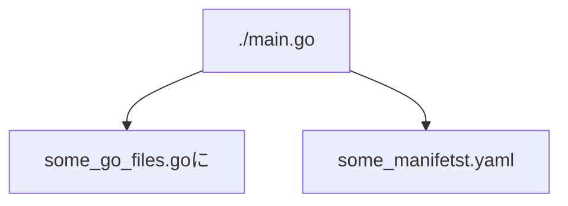

# つくって学ぶ Kubebuilder

## CustomController の基礎

* Custom Resource を利用するためには、OpenAPI v3.0 形式で Custom Resource Definison(CRD) を書く必要がる
* k8s では、あるリソースの状態をチェックして何らかの処理を行うプログラムのことをコントローラーと呼ぶ。
  *  例えば Deployment リソースに基づいて ReplicaSet リソースを作成しているのも、コントローラーの一つと言える
* k8s には標準リソースに対応する数多くのコントローラーが存在することがわかる: https://github.com/kubernetes/kubernetes/tree/master/pkg/controller
* 標準で装備されているものと、カスタムリソースを対象としたコントローラーを、カスタムコントローラーと呼ぶ

---


* Reconciliation Loop
  * コントローラーのメインロジック。リソースに記述された状態を理想とし、システムの現在の状態と比較し、その差分がなくなるように調整する処理を実行し続ける。
    * これによって宣言的な状態を維持し続けるのだな
  * 冪等
    * Reconciliation Loop は冪等性を備えていなければならない
    * Pod が3つなら、何度 Reconcile が呼ばれても Pod は3つにしなければならない
      * 追加で3つつくったりしちゃだめよ

* トリガー: エッジドリブンとレベルドリブン
  * よく分かってない
  * 具体的な現場を見るのとDeployment 抽象の両方を見ないと行けないから発生している違い？

---

Controlloer は「あるべき状態でないときに、あるべき状態にするための処理をするもの」と考えればいい

## MarkdownViewController

* MarkdownViewController
  * ユーザーが用意した Markdown をレンダリングしてブラウザから閲覧できるようにサービスを提供するコントローラー
  * Markdown のレンダリングには mdBook を利用する
    * https://rust-lang.github.io/mdBook/

* ユーザーは MrakdownView カスタムリソースを作成する
* MarkdownViewResource
  * CustomResource に記述された Markdown を COnifgMap リソースとして作成
  * Markdown をレンダリングするための mdBook を Deployment リソースとして作成
  * mdBook にアクセスするための Service リソースを作成
* ユーザーは、作成されたサービスを経由して、レンダリングされた Markdown を閲覧できる

### MarkdownView CustomResource


```yml
apiVersion: view.zuetrope.github.io/v1
kind: MarkdownView
metadata:
  name: markdownview-sample
spec:
  markdowns:
    SUMMARY.md: |
      # Summary

      - [Page1](page1.md)
    page1.md: |
      # Page 1

      一ページ目のコンテンツです。
  replicas: 1
  viewerImage: "peaceiris/mdbook:latest"
```

```bash
 codes
├── 00_scaffold:  Kubebuilderで生成したコード
├── 10_tilt:      Tiltを利用した開発環境のセットアップを追加
├── 20_manifests: CRD, RBAC, Webhook用のマニフェストを生成
├── 30_client:    クライアントライブラリの利用例を追加
├── 40_reconcile: Reconcile処理、およびWebhookを実装
└── 50_completed: Finalizer, Recorder, モニタリングのコードを追加
```

---

# Kubebuilder

* `kubebuilder` とは、 CustomController のプロジェクトの雛形を自動作成するためのツール。
* ソースコードだけでなく、 Makefile や Dockerfile, 各種マニフェストなど数多くのファイルを生成する。

```bash

try_kubebuilder on  main [!?] on ☁️  (ap-northeast-1) 
❯ ./kubebuilder -h
CLI tool for building Kubernetes extensions and tools.

Usage:
  kubebuilder [flags]
  kubebuilder [command]

Examples:
The first step is to initialize your project:
    kubebuilder init [--plugins=<PLUGIN KEYS> [--project-version=<PROJECT VERSION>]]

<PLUGIN KEYS> is a comma-separated list of plugin keys from the following table
and <PROJECT VERSION> a supported project version for these plugins.

                              Plugin keys | Supported project versions
------------------------------------------+----------------------------
                base.go.kubebuilder.io/v3 |                          3
         declarative.go.kubebuilder.io/v1 |                       2, 3
  deploy-image.go.kubebuilder.io/v1-alpha |                          3
                     go.kubebuilder.io/v2 |                       2, 3
                     go.kubebuilder.io/v3 |                          3
               go.kubebuilder.io/v4-alpha |                          3
          grafana.kubebuilder.io/v1-alpha |                          3
       kustomize.common.kubebuilder.io/v1 |                          3
 kustomize.common.kubebuilder.io/v2-alpha |                          3

For more specific help for the init command of a certain plugins and project version
configuration please run:
    kubebuilder init --help --plugins=<PLUGIN KEYS> [--project-version=<PROJECT VERSION>]

Default plugin keys: "go.kubebuilder.io/v3"
Default project version: "3"


Available Commands:
  alpha       Alpha-stage subcommands
  completion  Load completions for the specified shell
  create      Scaffold a Kubernetes API or webhook
  edit        Update the project configuration
  help        Help about any command
  init        Initialize a new project
  version     Print the kubebuilder version

Flags:
  -h, --help                     help for kubebuilder
      --plugins strings          plugin keys to be used for this subcommand execution
      --project-version string   project version (default "3")

Use "kubebuilder [command] --help" for more information about a command.

try_kubebuilder on  main [!?] on ☁️  (ap-northeast-1) 
❯ 
```

subcommand。 本編では `init` と `create` を触っていく。

```bash

❯ ./kubebuilder -h | grep Available -A8
Available Commands:
  alpha       Alpha-stage subcommands
  completion  Load completions for the specified shell
  create      Scaffold a Kubernetes API or webhook
  edit        Update the project configuration
  help        Help about any command
  init        Initialize a new project
  version     Print the kubebuilder version


try_kubebuilder on  main [!?] on ☁️  (ap-northeast-1) 
❯ 

```

## プロジェクトの雛形作成

```bash
$ kubebuilder init --domain say3no.github.io --repo this/repo
```


## APIの雛形作成

```bash
$ kubebuilder create api --group view --version v1 --kind MarkdownView
```

生成するカスタムリソースの GVK 

* `--group`: リソースが属するグループ名を指定
* `--version`: 適切なバージョンを指定。今後使用が変わる可能性ｇありそうなら `v1alpha1` とかにするとか
* `--kind` : 作成するリソースの名前


---

- api
  - v1
    - `markdownview_types.go` <- `api/v1` 配下はこいつだけ弄るとおもってればおｋ
    - ...
    - ...
- cotroller
  - `markdownview_controller.go` <- CR Controller 本体
  - `suite_test.go`
- config
  - crd <- Custom Resource Definison
    - bases
      - `view.say3no.github.io_markdownviews.yaml`
    - `kustomization.yaml`
    - `kustomizeconfig.yaml`
    - patches
      - `cainjection_in_markdwonviews.yaml`
      - `webhook_in_markdownviews.yaml`
  - rbac
    - `role.yaml`
    - `markdownview_editor_role.yaml`
    - `markdownview_viewer_role.yaml`
  - samples
    - `view_v1_markdownview.yaml`


## Webhookの雛形作成

* k8s の拡張機能: admission webhook 
  * 特定のリソースおｗ作成/更新する際に Webhook API を呼び出し、バリデーションやリソースの書き換えを行うための機能
    * ansible の handler みたいな
* `kubebuilder` で生成可能な 3種類 の Webhook Option 。 主に使うのは上位2つかな
  * `--programmatic-validation`: リソースのバリデーションの Webhook
  * `--defaulting`: リソースのフィールドにデフォルト値を設定するための Webhook
  * `--conversion`: カスタムリソースのバージョンアップ時にリソースの変換をおこなうための Webhhok

```bash
$ kubebuilder create webhook --group view --verison v1 --kind MarkdownView --programmatic-validation --defaulting
try_kubebuilder/markdown-view on  main [!] via 🐹 v1.19.2 on ☁️  (ap-northeast-1) 
❯ ../kubebuilder create webhook --group view --version v1 --kind MarkdownView --programmatic-validation --defaulting
Writing kustomize manifests for you to edit...
Writing scaffold for you to edit...
api/v1/markdownview_webhook.go
Update dependencies:
$ go mod tidy
Running make:
$ make generate
/Users/sanosei/github.com/say3no/try_kubebuilder/markdown-view/bin/controller-gen object:headerFile="hack/boilerplate.go.txt" paths="./..."
Next: implement your new Webhook and generate the manifests with:
$ make manifests
```

---


```bash
try_kubebuilder/markdown-view on  main [!?] via 🐹 v1.19.2 on ☁️  (ap-northeast-1) 
❯ make manifests 
/Users/sanosei/github.com/say3no/try_kubebuilder/markdown-view/bin/controller-gen rbac:roleName=manager-role crd webhook paths="./..." output:crd:artifacts:config=config/crd/bases

```

---

生成されたものたち

- api
  - v1
    - `markdownView_webhook.go` <- だいじ
    - `webhook_suite_test.go`
- config
  - certmanager <- Admission Webhook を利用するためには証明書が必要。そのための諸 yaml
    - `certificate.yaml`
    - `kustoization.yaml`
    - `kustomizeconfig.yaml`
  - default
    - `manager_webhook_patch.yaml`
    - `webhookcainjection_patch.yaml`
  - webhook <- マニフェストファイルのみなさん
    - `kustomization.yaml`
    - `kustomizeconfig.yaml`
    - `manifests.yaml`
    - `service.yaml`

### kustomization.yaml の編集

* 生成直後の状態では make manifests コマンドで マニフェストを生成しても、 Webhook機能が利用できるようにはなっていない
* こいつがコミットされた diff を見てくれ~~~


## カスタムコントローラーの動作確認


```bash
try_kubebuilder/markdown-view on  main via 🐹 v1.19.2 on ☁️  (ap-northeast-1) 
❯ kind create cluster
Creating cluster "kind" ...
 ✓ Ensuring node image (kindest/node:v1.25.2) 🖼 
 ✓ Preparing nodes 📦  
 ✓ Writing configuration 📜 
 ✓ Starting control-plane 🕹️ 
 ✓ Installing CNI 🔌 
 ✓ Installing StorageClass 💾 
Set kubectl context to "kind-kind"
You can now use your cluster with:

kubectl cluster-info --context kind-kind

Thanks for using kind! 😊

try_kubebuilder/markdown-view on  main via 🐹 v1.19.2 on ☁️  (ap-northeast-1) took 1m 
❯ kubectl apply --validate=false -f https://github.com/jetstack/cert-manager/releases/latest/download/cert-manager.yaml  

namespace/cert-manager created
customresourcedefinition.apiextensions.k8s.io/certificaterequests.cert-manager.io created
customresourcedefinition.apiextensions.k8s.io/certificates.cert-manager.io created
customresourcedefinition.apiextensions.k8s.io/challenges.acme.cert-manager.io created
customresourcedefinition.apiextensions.k8s.io/clusterissuers.cert-manager.io created
customresourcedefinition.apiextensions.k8s.io/issuers.cert-manager.io created
customresourcedefinition.apiextensions.k8s.io/orders.acme.cert-manager.io created
serviceaccount/cert-manager-cainjector created
serviceaccount/cert-manager created
serviceaccount/cert-manager-webhook created
configmap/cert-manager-webhook created
clusterrole.rbac.authorization.k8s.io/cert-manager-cainjector created
clusterrole.rbac.authorization.k8s.io/cert-manager-controller-issuers created
clusterrole.rbac.authorization.k8s.io/cert-manager-controller-clusterissuers created
clusterrole.rbac.authorization.k8s.io/cert-manager-controller-certificates created
clusterrole.rbac.authorization.k8s.io/cert-manager-controller-orders created
clusterrole.rbac.authorization.k8s.io/cert-manager-controller-challenges created
clusterrole.rbac.authorization.k8s.io/cert-manager-controller-ingress-shim created
clusterrole.rbac.authorization.k8s.io/cert-manager-view created
clusterrole.rbac.authorization.k8s.io/cert-manager-edit created
clusterrole.rbac.authorization.k8s.io/cert-manager-controller-approve:cert-manager-io created
clusterrole.rbac.authorization.k8s.io/cert-manager-controller-certificatesigningrequests created
clusterrole.rbac.authorization.k8s.io/cert-manager-webhook:subjectaccessreviews created
clusterrolebinding.rbac.authorization.k8s.io/cert-manager-cainjector created
clusterrolebinding.rbac.authorization.k8s.io/cert-manager-controller-issuers created
clusterrolebinding.rbac.authorization.k8s.io/cert-manager-controller-clusterissuers created
clusterrolebinding.rbac.authorization.k8s.io/cert-manager-controller-certificates created
clusterrolebinding.rbac.authorization.k8s.io/cert-manager-controller-orders created
clusterrolebinding.rbac.authorization.k8s.io/cert-manager-controller-challenges created
clusterrolebinding.rbac.authorization.k8s.io/cert-manager-controller-ingress-shim created
clusterrolebinding.rbac.authorization.k8s.io/cert-manager-controller-approve:cert-manager-io created
clusterrolebinding.rbac.authorization.k8s.io/cert-manager-controller-certificatesigningrequests created
clusterrolebinding.rbac.authorization.k8s.io/cert-manager-webhook:subjectaccessreviews created
role.rbac.authorization.k8s.io/cert-manager-cainjector:leaderelection created
role.rbac.authorization.k8s.io/cert-manager:leaderelection created
role.rbac.authorization.k8s.io/cert-manager-webhook:dynamic-serving created
rolebinding.rbac.authorization.k8s.io/cert-manager-cainjector:leaderelection created
rolebinding.rbac.authorization.k8s.io/cert-manager:leaderelection created
rolebinding.rbac.authorization.k8s.io/cert-manager-webhook:dynamic-serving created
service/cert-manager created
service/cert-manager-webhook created
deployment.apps/cert-manager-cainjector created
deployment.apps/cert-manager created
deployment.apps/cert-manager-webhook created
mutatingwebhookconfiguration.admissionregistration.k8s.io/cert-manager-webhook created
validatingwebhookconfiguration.admissionregistration.k8s.io/cert-manager-webhook created

try_kubebuilder/markdown-view on  main [!] via 🐹 v1.19.2 on ☁️  (ap-northeast-1) 
❯ kubectl get pod -n cert-manager
NAME                                       READY   STATUS    RESTARTS   AGE
cert-manager-cainjector-857ff8f7cb-bpq9h   1/1     Running   0          5m9s
cert-manager-d58554549-x5xf2               1/1     Running   0          5m9s
cert-manager-webhook-76fdf7c485-5d8rz      1/1     Running   0          5m9s

try_kubebuilder/markdown-view on  main [!] via 🐹 v1.19.2 on ☁️  (ap-northeast-1) 
❯ 
```


---

### コントローラーの動作確認

* arm は v3.8.7 がないっぽい

```bash
❯ make install
test -s /Users/sanosei/github.com/say3no/try_kubebuilder/markdown-view/bin/controller-gen || GOBIN=/Users/sanosei/github.com/say3no/try_kubebuilder/markdown-view/bin go install sigs.k8s.io/controller-tools/cmd/controller-gen@v0.9.2
/Users/sanosei/github.com/say3no/try_kubebuilder/markdown-view/bin/controller-gen rbac:roleName=manager-role crd webhook paths="./..." output:crd:artifacts:config=config/crd/bases
test -s /Users/sanosei/github.com/say3no/try_kubebuilder/markdown-view/bin/kustomize || { curl -Ss "https://raw.githubusercontent.com/kubernetes-sigs/kustomize/master/hack/install_kustomize.sh" | bash -s -- 3.8.7 /Users/sanosei/github.com/say3no/try_kubebuilder/markdown-view/bin; }
Version v3.8.7 does not exist or is not available for darwin/arm64.
make: *** [/Users/sanosei/github.com/say3no/try_kubebuilder/markdown-view/bin/kustomize] Error 1

try_kubebuilder/markdown-view on  main via 🐹 v1.19.2 on ☁️  (ap-northeast-1) 
❯ 
```

* https://qiita.com/nakamasato/items/5a4018c73d7d1e6da025

```bash
$ export KUSTOMIZE_VERSION=v4.2.0
$ make install
```

パスした

```bash
try_kubebuilder/markdown-view on  main [!] via 🐹 v1.19.2 on ☁️  (ap-northeast-1) 
❯ export KUSTOMIZE_VERSION=v4.2.0

try_kubebuilder/markdown-view on  main [!] via 🐹 v1.19.2 on ☁️  (ap-northeast-1) 
❯ make install
test -s /Users/sanosei/github.com/say3no/try_kubebuilder/markdown-view/bin/controller-gen || GOBIN=/Users/sanosei/github.com/say3no/try_kubebuilder/markdown-view/bin go install sigs.k8s.io/controller-tools/cmd/controller-gen@v0.9.2
/Users/sanosei/github.com/say3no/try_kubebuilder/markdown-view/bin/controller-gen rbac:roleName=manager-role crd webhook paths="./..." output:crd:artifacts:config=config/crd/bases
test -s /Users/sanosei/github.com/say3no/try_kubebuilder/markdown-view/bin/kustomize || { curl -Ss "https://raw.githubusercontent.com/kubernetes-sigs/kustomize/master/hack/install_kustomize.sh" | bash -s -- 4.2.0 /Users/sanosei/github.com/say3no/try_kubebuilder/markdown-view/bin; }
{Version:kustomize/v4.2.0 GitCommit:d53a2ad45d04b0264bcee9e19879437d851cb778 BuildDate:2021-06-30T22:49:26Z GoOs:darwin GoArch:arm64}
kustomize installed to /Users/sanosei/github.com/say3no/try_kubebuilder/markdown-view/bin/kustomize
/Users/sanosei/github.com/say3no/try_kubebuilder/markdown-view/bin/kustomize build config/crd | kubectl apply -f -
customresourcedefinition.apiextensions.k8s.io/markdownviews.view.say3no.github.io created

try_kubebuilder/markdown-view on  main [!] via 🐹 v1.19.2 on ☁️  (ap-northeast-1) took 5s 
❯ ```

---

```bash
❯ make deploy
test -s /Users/sanosei/github.com/say3no/try_kubebuilder/markdown-view/bin/controller-gen || GOBIN=/Users/sanosei/github.com/say3no/try_kubebuilder/markdown-view/bin go install sigs.k8s.io/controller-tools/cmd/controller-gen@v0.9.2
/Users/sanosei/github.com/say3no/try_kubebuilder/markdown-view/bin/controller-gen rbac:roleName=manager-role crd webhook paths="./..." output:crd:artifacts:config=config/crd/bases
cd config/manager && /Users/sanosei/github.com/say3no/try_kubebuilder/markdown-view/bin/kustomize edit set image controller=controller:latest
/Users/sanosei/github.com/say3no/try_kubebuilder/markdown-view/bin/kustomize build config/default | kubectl apply -f -
namespace/markdown-view-system unchanged
customresourcedefinition.apiextensions.k8s.io/markdownviews.view.say3no.github.io unchanged
serviceaccount/markdown-view-controller-manager unchanged
role.rbac.authorization.k8s.io/markdown-view-leader-election-role unchanged
clusterrole.rbac.authorization.k8s.io/markdown-view-manager-role configured
clusterrole.rbac.authorization.k8s.io/markdown-view-metrics-reader unchanged
clusterrole.rbac.authorization.k8s.io/markdown-view-proxy-role unchanged
rolebinding.rbac.authorization.k8s.io/markdown-view-leader-election-rolebinding unchanged
clusterrolebinding.rbac.authorization.k8s.io/markdown-view-manager-rolebinding unchanged
clusterrolebinding.rbac.authorization.k8s.io/markdown-view-proxy-rolebinding unchanged
service/markdown-view-controller-manager-metrics-service unchanged
service/markdown-view-webhook-service unchanged
deployment.apps/markdown-view-controller-manager unchanged
certificate.cert-manager.io/markdown-view-serving-cert unchanged
issuer.cert-manager.io/markdown-view-selfsigned-issuer unchanged
mutatingwebhookconfiguration.admissionregistration.k8s.io/markdown-view-mutating-webhook-configuration configured
validatingwebhookconfiguration.admissionregistration.k8s.io/markdown-view-validating-webhook-configuration configured

try_kubebuilder/markdown-view on  main [!⇡] via 🐹 v1.19.2 on ☁️  (ap-northeast-1) 
❯ ```


```bash
❯  kubectl get pod -n markdown-view-system
NAME                                                READY   STATUS    RESTARTS   AGE
markdown-view-controller-manager-548cff7b6f-kqbjb   2/2     Running   0          4m59s

try_kubebuilder/markdown-view on  main [!] via 🐹 v1.19.2 on ☁️  (ap-northeast-1) 
❯ 
```

log がでている

```bash

❯ kubectl logs  -n markdown-view-system markdown-view-controller-manager-548cff7b6f-kqbjb -c manager -f
1.6652454396743307e+09  INFO    controller-runtime.metrics      Metrics server is starting to listen    {"addr": "127.0.0.1:8080"}
1.665245439674532e+09   INFO    controller-runtime.builder      Registering a mutating webhook  {"GVK": "view.say3no.github.io/v1, Kind=MarkdownView", "path": "/mutate-view-say3no-github-io-v1-markdownview"}
1.665245439674574e+09   INFO    controller-runtime.webhook      Registering webhook     {"path": "/mutate-view-say3no-github-io-v1-markdownview"}
1.6652454396745944e+09  INFO    controller-runtime.builder      Registering a validating webhook        {"GVK": "view.say3no.github.io/v1, Kind=MarkdownView", "path": "/validate-view-say3no-github-io-v1-markdownview"}
1.665245439674616e+09   INFO    controller-runtime.webhook      Registering webhook     {"path": "/validate-view-say3no-github-io-v1-markdownview"}
1.6652454396746435e+09  INFO    setup   starting manager
1.6652454396748865e+09  INFO    Starting server {"path": "/metrics", "kind": "metrics", "addr": "127.0.0.1:8080"}
1.6652454396749735e+09  INFO    Starting server {"kind": "health probe", "addr": "[::]:8081"}
1.6652454396748748e+09  INFO    controller-runtime.webhook.webhooks     Starting webhook server
1.6652454396750708e+09  INFO    controller-runtime.certwatcher  Updated current TLS certificate
I1008 16:10:39.675084       1 leaderelection.go:248] attempting to acquire leader lease markdown-view-system/952d835c.say3no.github.io...
1.6652454396751184e+09  INFO    controller-runtime.webhook      Serving webhook server  {"host": "", "port": 9443}
1.665245439675223e+09   INFO    controller-runtime.certwatcher  Starting certificate watcher
I1008 16:10:39.678102       1 leaderelection.go:258] successfully acquired lease markdown-view-system/952d835c.say3no.github.io
1.665245439678144e+09   DEBUG   events  markdown-view-controller-manager-548cff7b6f-kqbjb_af5d9842-822e-49cc-8ecf-baa6cfcb51b4 became leader    {"type": "Normal", "object": {"kind":"Lease","namespace":"markdown-view-system","name":"952d835c.say3no.github.io","uid":"5452541e-a083-4cc8-b2d6-60171684fefc","apiVersion":"coordination.k8s.io/v1","resourceVersion":"8172"}, "reason": "LeaderElection"}
1.6652454396785386e+09  INFO    Starting EventSource    {"controller": "markdownview", "controllerGroup": "view.say3no.github.io", "controllerKind": "MarkdownView", "source": "kind source: *v1.MarkdownView"}
1.6652454396785576e+09  INFO    Starting Controller     {"controller": "markdownview", "controllerGroup": "view.say3no.github.io", "controllerKind": "MarkdownView"}
1.665245439780741e+09   INFO    Starting workers        {"controller": "markdownview", "controllerGroup": "view.say3no.github.io", "controllerKind": "MarkdownView", "worker count": 1}
^C
```

別窓で イカ実行
```bash
❯ kubectl apply -f config/samples/view_v1_markdownview.yaml
markdownview.view.say3no.github.io/markdownview-sample created
```

200 を返していそう

```bash
...
1.665245439780741e+09   INFO    Starting workers        {"controller": "markdownview", "controllerGroup": "view.say3no.github.io", "controllerKind": "MarkdownView", "worker count": 1}
1.6652463090219948e+09  DEBUG   controller-runtime.webhook.webhooks     received request        {"webhook": "/mutate-view-say3no-github-io-v1-markdownview", "UID": "7bcedd20-cac1-42c5-ac6d-76103c0b3db2", "kind": "view.say3no.github.io/v1, Kind=MarkdownView", "resource": {"group":"view.say3no.github.io","version":"v1","resource":"markdownviews"}}
1.6652463090221906e+09  INFO    markdownview-resource   default {"name": "markdownview-sample"}
1.6652463090224829e+09  DEBUG   controller-runtime.webhook.webhooks     wrote response  {"webhook": "/mutate-view-say3no-github-io-v1-markdownview", "code": 200, "reason": "", "UID": "7bcedd20-cac1-42c5-ac6d-76103c0b3db2", "allowed": true}
1.665246309026078e+09   DEBUG   controller-runtime.webhook.webhooks     received request        {"webhook": "/validate-view-say3no-github-io-v1-markdownview", "UID": "cd347bf1-609f-4282-a0e2-787ca188c7a5", "kind": "view.say3no.github.io/v1, Kind=MarkdownView", "resource": {"group":"view.say3no.github.io","version":"v1","resource":"markdownviews"}}
1.6652463090261595e+09  INFO    markdownview-resource   validate create {"name": "markdownview-sample"}
1.6652463090261793e+09  DEBUG   controller-runtime.webhook.webhooks     wrote response  {"webhook": "/validate-view-say3no-github-io-v1-markdownview", "code": 200, "reason": "", "UID": "cd347bf1-609f-4282-a0e2-787ca188c7a5", "allowed": true}
```

### 開発の流れ

#### Controller の実装が変わったときは、以下のコマンドで docker build -> load to kind

```bash
$ make docker-build
$ kind load docker-image controller:latest
```

#### CRD に変更がある場合は、以下

```bash
$ make install
```

非互換な変換をした場合は、事前に `make uninstall`

#### CRD 以外のマニフェストファイルに変更がある場合

```bash
$ make deploy
```

#### 次のコマンドでカスタムコントローラの再起動

```bash
$ kubectl rollout restart -n markdown-view-system deployment markdown-view-controller-manager
```

### Tilt による効率的な開発

要するに変更を watch して action をするタスクランナーっぽい。
こっちは後回しでいいや

# controller-tools

* Kubebuilder では CC の開発を補助するためのツール群として [controller-tools](https://github.com/kubernetes-sigs/controller-tools)を提供している。おもに以下3つからなるが、今回取り扱うのは controller-gen のみ
  * controller-gen
  * type-scaffold
  * helpgen

* controller-gen は Go のソースコードをもとに、 Manifest や Go のソースコードを生成する
  
のだが、自分の環境にはまだ `controller-gen cli` がインストールされていないようだ。
とおもったが `find . | grep controller-gen` したら `./bin/` にあったわ ガハハ

```bash
❯ ./bin/controller-gen -h
Usage:
  controller-gen [flags]

Examples:
        # Generate RBAC manifests and crds for all types under apis/,
        # outputting crds to /tmp/crds and everything else to stdout
        controller-gen rbac:roleName=<role name> crd paths=./apis/... output:crd:dir=/tmp/crds output:stdout

        # Generate deepcopy/runtime.Object implementations for a particular file
        controller-gen object paths=./apis/v1beta1/some_types.go

        # Generate OpenAPI v3 schemas for API packages and merge them into existing CRD manifests
        controller-gen schemapatch:manifests=./manifests output:dir=./manifests paths=./pkg/apis/... 

        # Run all the generators for a given project
        controller-gen paths=./apis/...

        # Explain the markers for generating CRDs, and their arguments
        controller-gen crd -ww


Flags:
  -h, --detailed-help count   print out more detailed help
                              (up to -hhh for the most detailed output, or -hhhh for json output)
      --help                  print out usage and a summary of options
      --version               show version
  -w, --which-markers count   print out all markers available with the requested generators
                              (up to -www for the most detailed output, or -wwww for json output)


Options


generators

+webhook                                                                                                                                           package  generates (partial) {Mutating,Validating}WebhookConfiguration objects.                        
+schemapatch[:generateEmbeddedObjectMeta=<bool>],manifests=<string>[,maxDescLen=<int>]                                                             package  patches existing CRDs with new schemata.                                                      
+rbac:roleName=<string>                                                                                                                            package  generates ClusterRole objects.                                                                
+object[:headerFile=<string>][,year=<string>]                                                                                                      package  generates code containing DeepCopy, DeepCopyInto, and DeepCopyObject method implementations.  
+crd[:allowDangerousTypes=<bool>][,crdVersions=<[]string>][,generateEmbeddedObjectMeta=<bool>][,ignoreUnexportedFields=<bool>][,maxDescLen=<int>]  package  generates CustomResourceDefinition objects.                                                   


generic

+paths=<[]string>  package  represents paths and go-style path patterns to use as package roots.  


output rules (optionally as output:<generator>:...)

+output:artifacts[:code=<string>],config=<string>  package  outputs artifacts to different locations, depending on whether they're package-associated or not.   
+output:dir=<string>                               package  outputs each artifact to the given directory, regardless of if it's package-associated or not.      
+output:none                                       package  skips outputting anything.                                                                          
+output:stdout                                     package  outputs everything to standard-out, with no separation.                                             


try_kubebuilder/markdown-view on  main [!] via 🐹 v1.19.2 on ☁️  (ap-northeast-1) 
❯
```

>kubebuilderが生成したMakefileには、make manifestsとmake generateというターゲットが用意されており、make manifestsではwebhook, rbac, crdの生成、make generateではobjectの生成がおこなわれます。

こういうことかな？

| Makefile      | controller-gen     |
| :------------ | ------------------ |
| make generate | object             |
| make manifest | webhook, rbac, crd |

`schemapatch` はマップの中にないらしい。

Kubebuilder -> プロジェクトの雛形作成 -> `main.go` では、以下の記述があった。

>これから作成するカスタムコントローラーのエントリーポイントとなるソースコードです。
>
>ソースコード中に**//+kubebuilder:scaffold:imports**, //+kubebuilder:scaffold:scheme, //+kubebuilder:scaffold:builderなどのコメントが記述されています。 Kubebuilderはこれらのコメントを目印にソースコードの自動生成をおこなうので、決して削除しないように注意してください。


`cntroller-gen` は、 `go` のコードから、 CC のための `go`, それに対応した Maniest を生成する際には、こうした情報をマーカーとしてやっているらしい。



`controller-gen` のマーカー一覧は、 `-w` オプションで確認できる

webhook のマーカーは一つしかない

```bash
❯ ./bin/controller-gen webhook -w

Webhook

+kubebuilder:webhook:admissionReviewVersions=<[]string>,failurePolicy=<string>,groups=<[]string>[,matchPolicy=<string>],mutating=<bool>,name=<string>,path=<string>,resources=<[]string>[,sideEffects=<string>],verbs=<[]string>,versions=<[]string>[,webhookVersions=<[]string>]  package  specifies how a webhook should be served.   


try_kubebuilder/markdown-view on  main [!] via 🐹 v1.19.2 on ☁️  (ap-northeast-1) 
❯ 
```

<details>
<summar> Custom Resource Definision はいっぱいある </summary>

```bash
❯ ./bin/controller-gen crd -w        

CRD

+groupName=<string>                                                                                                               package  specifies the API group name for this package.                                    
+kubebuilder:deprecatedversion[:warning=<string>]                                                                                 type     marks this version as deprecated.                                                 
+kubebuilder:printcolumn:JSONPath=<string>[,description=<string>][,format=<string>],name=<string>[,priority=<int>],type=<string>  type     adds a column to "kubectl get" output for this CRD.                               
+kubebuilder:resource[:categories=<[]string>][,path=<string>][,scope=<string>][,shortName=<[]string>][,singular=<string>]         type     configures naming and scope for a CRD.                                            
+kubebuilder:skip                                                                                                                 package  don't consider this package as an API version.                                    
+kubebuilder:skipversion                                                                                                          type     removes the particular version of the CRD from the CRDs spec.                     
+kubebuilder:storageversion                                                                                                       type     marks this version as the "storage version" for the CRD for conversion.           
+kubebuilder:subresource:scale[:selectorpath=<string>],specpath=<string>,statuspath=<string>                                      type     enables the "/scale" subresource on a CRD.                                        
+kubebuilder:subresource:status                                                                                                   type     enables the "/status" subresource on a CRD.                                       
+kubebuilder:unservedversion                                                                                                      type     does not serve this version.                                                      
+versionName=<string>                                                                                                             package  overrides the API group version for this package (defaults to the package name).  


CRD processing

+kubebuilder:pruning:PreserveUnknownFields      type   PreserveUnknownFields stops the apiserver from pruning fields which are not specified.                                                                            
+kubebuilder:pruning:PreserveUnknownFields      field  PreserveUnknownFields stops the apiserver from pruning fields which are not specified.                                                                            
+kubebuilder:validation:XPreserveUnknownFields  type   PreserveUnknownFields stops the apiserver from pruning fields which are not specified.                                                                            
+kubebuilder:validation:XPreserveUnknownFields  field  PreserveUnknownFields stops the apiserver from pruning fields which are not specified.                                                                            
+listMapKey=<string>                            type   specifies the keys to map listTypes.                                                                                                                              
+listMapKey=<string>                            field  specifies the keys to map listTypes.                                                                                                                              
+listType=<string>                              type   specifies the type of data-structure that the list represents (map, set, atomic).                                                                                 
+listType=<string>                              field  specifies the type of data-structure that the list represents (map, set, atomic).                                                                                 
+mapType=<string>                               type   specifies the level of atomicity of the map; i.e. whether each item in the map is independent of the others, or all fields are treated as a single unit.          
+mapType=<string>                               field  specifies the level of atomicity of the map; i.e. whether each item in the map is independent of the others, or all fields are treated as a single unit.          
+structType=<string>                            type   specifies the level of atomicity of the struct; i.e. whether each field in the struct is independent of the others, or all fields are treated as a single unit.   
+structType=<string>                            field  specifies the level of atomicity of the struct; i.e. whether each field in the struct is independent of the others, or all fields are treated as a single unit.   


CRD validation

+kubebuilder:default=<any>                                            field    sets the default value for this field.                                                               
+kubebuilder:validation:EmbeddedResource                              field    EmbeddedResource marks a fields as an embedded resource with apiVersion, kind and metadata fields.   
+kubebuilder:validation:Enum=<[]any>                                  field    specifies that this (scalar) field is restricted to the *exact* values specified here.               
+kubebuilder:validation:Enum=<[]any>                                  type     specifies that this (scalar) field is restricted to the *exact* values specified here.               
+kubebuilder:validation:ExclusiveMaximum=<bool>                       field    indicates that the maximum is "up to" but not including that value.                                  
+kubebuilder:validation:ExclusiveMaximum=<bool>                       type     indicates that the maximum is "up to" but not including that value.                                  
+kubebuilder:validation:ExclusiveMinimum=<bool>                       field    indicates that the minimum is "up to" but not including that value.                                  
+kubebuilder:validation:ExclusiveMinimum=<bool>                       type     indicates that the minimum is "up to" but not including that value.                                  
+kubebuilder:validation:Format=<string>                               type     specifies additional "complex" formatting for this field.                                            
+kubebuilder:validation:Format=<string>                               field    specifies additional "complex" formatting for this field.                                            
+kubebuilder:validation:MaxItems=<int>                                field    specifies the maximum length for this list.                                                          
+kubebuilder:validation:MaxItems=<int>                                type     specifies the maximum length for this list.                                                          
+kubebuilder:validation:MaxLength=<int>                               field    specifies the maximum length for this string.                                                        
+kubebuilder:validation:MaxLength=<int>                               type     specifies the maximum length for this string.                                                        
+kubebuilder:validation:MaxProperties=<int>                           field    restricts the number of keys in an object                                                            
+kubebuilder:validation:MaxProperties=<int>                           type     restricts the number of keys in an object                                                            
+kubebuilder:validation:Maximum=<>                                    field    specifies the maximum numeric value that this field can have.                                        
+kubebuilder:validation:Maximum=<>                                    type     specifies the maximum numeric value that this field can have.                                        
+kubebuilder:validation:MinItems=<int>                                type     specifies the minimun length for this list.                                                          
+kubebuilder:validation:MinItems=<int>                                field    specifies the minimun length for this list.                                                          
+kubebuilder:validation:MinLength=<int>                               field    specifies the minimum length for this string.                                                        
+kubebuilder:validation:MinLength=<int>                               type     specifies the minimum length for this string.                                                        
+kubebuilder:validation:MinProperties=<int>                           field    restricts the number of keys in an object                                                            
+kubebuilder:validation:MinProperties=<int>                           type     restricts the number of keys in an object                                                            
+kubebuilder:validation:Minimum=<>                                    type     specifies the minimum numeric value that this field can have. Negative numbers are supported.        
+kubebuilder:validation:Minimum=<>                                    field    specifies the minimum numeric value that this field can have. Negative numbers are supported.        
+kubebuilder:validation:MultipleOf=<>                                 field    specifies that this field must have a numeric value that's a multiple of this one.                   
+kubebuilder:validation:MultipleOf=<>                                 type     specifies that this field must have a numeric value that's a multiple of this one.                   
+kubebuilder:validation:Optional                                      field    specifies that this field is optional, if fields are required by default.                            
+kubebuilder:validation:Optional                                      package  specifies that all fields in this package are optional by default.                                   
+kubebuilder:validation:Pattern=<string>                              type     specifies that this string must match the given regular expression.                                  
+kubebuilder:validation:Pattern=<string>                              field    specifies that this string must match the given regular expression.                                  
+kubebuilder:validation:Required                                      field    specifies that this field is required, if fields are optional by default.                            
+kubebuilder:validation:Required                                      package  specifies that all fields in this package are required by default.                                   
+kubebuilder:validation:Schemaless                                    field    marks a field as being a schemaless object.                                                          
+kubebuilder:validation:Type=<string>                                 field    overrides the type for this field (which defaults to the equivalent of the Go type).                 
+kubebuilder:validation:Type=<string>                                 type     overrides the type for this field (which defaults to the equivalent of the Go type).                 
+kubebuilder:validation:UniqueItems=<bool>                            field    specifies that all items in this list must be unique.                                                
+kubebuilder:validation:UniqueItems=<bool>                            type     specifies that all items in this list must be unique.                                                
+kubebuilder:validation:XEmbeddedResource                             field    EmbeddedResource marks a fields as an embedded resource with apiVersion, kind and metadata fields.   
+kubebuilder:validation:XEmbeddedResource                             type     EmbeddedResource marks a fields as an embedded resource with apiVersion, kind and metadata fields.   
+kubebuilder:validation:XIntOrString                                  type     IntOrString marks a fields as an IntOrString.                                                        
+kubebuilder:validation:XIntOrString                                  field    IntOrString marks a fields as an IntOrString.                                                        
+kubebuilder:validation:XValidation[:message=<string>],rule=<string>  type     marks a field as requiring a value for which a given expression evaluates to true.                   
+kubebuilder:validation:XValidation[:message=<string>],rule=<string>  field    marks a field as requiring a value for which a given expression evaluates to true.                   
+nullable                                                             field    marks this field as allowing the "null" value.                                                       
+optional                                                             field    specifies that this field is optional, if fields are required by default.                            


try_kubebuilder/markdown-view on  main [!] via 🐹 v1.19.2 on ☁️  (ap-northeast-1) 
❯ 
```

</details>

## CRD マニフェストの生成

* CRD の定義は OpenAPIv3 の yaml で記述するといった。 CRD の Manifest は複雑で手書きは骨が折れる
* Kubebuilder の controller-gen は、 Go で記述した Struct から CRD を生成できる

以下は、`kubebuilder create api` の初期生成コードを `cat api/v1/markdownview_types.go| grep -v // | grep package -A300` でトリムしたもの。
`controller-gen` はこれらの構造体と Marker を頼りに CRD を生成する。

```go
package v1

import (
        metav1 "k8s.io/apimachinery/pkg/apis/meta/v1"
)

type MarkdownViewSpec struct {
        Foo string `json:"foo,omitempty"`
}

type MarkdownViewStatus struct {
}

//+kubebuilder:object:root=true
//+kubebuilder:subresource:status

type MarkdownView struct {
        metav1.TypeMeta   `json:",inline"`
        metav1.ObjectMeta `json:"metadata,omitempty"`
        Spec   MarkdownViewSpec   `json:"spec,omitempty"`
        Status MarkdownViewStatus `json:"status,omitempty"`
}

//+kubebuilder:object:root=true

type MarkdownViewList struct {
        metav1.TypeMeta `json:",inline"`
        metav1.ListMeta `json:"metadata,omitempty"`
        Items           []MarkdownView `json:"items"`
}

func init() {
        SchemeBuilder.Register(&MarkdownView{}, &MarkdownViewList{})
}
```

* 実際に生成されたコードに、変更を加えてみる。

答え?のやつと `sdiff` をしてみると desc と enum に差がある。
Enum は漏れだろうな。 desc はこっちも描画の対象だったか。

```bash
❯ sdiff -s markdownviews.yaml.ans markdown-view/config/crd/bases/view.say3no.github.io_markdownviews.yaml
  name: markdownviews.view.zoetrope.github.io                 |   name: markdownviews.view.say3no.github.io
  group: view.zoetrope.github.io                              |   group: view.say3no.github.io
        description: MarkdownView is the Schema for the markd <
                description: Markdowns contain the markdown f <
                  The key indicates the file name and must no <
                  The value is the content in markdown format <
                description: Replicas is the number of viewer <
                description: ViewerImage is the image name of |                 description: ViewerImage is the image name of
            description: MarkdownViewStatus defines the obser <
            enum:                                             <
            - NotReady                                        <
            - Available                                       <
            - Healthy                                         <

try_kubebuilder on  main [?⇡] on ☁️  (ap-northeast-1) 
❯ 
```

## RBAC マニフェストの生成

* k8sはRBAC(Role-based access control)により、リソースへのアクセス権を制御できる
* CCにおいても、生成するリソースにのみアクセスできるように適切な権限を設定する必要がある。
* `controller-gen` では、 Go のソースコード宙に埋め込まれたマーカーをもとにRBAの目にフェストを生成できる

まず、 `kubebuilder` が生成した初期状態のマーカを見てみる。

```bash
❯ cat ./controllers/markdownview_controller.go | grep +kubebuilder
//+kubebuilder:rbac:groups=view.say3no.github.io,resources=markdownviews,verbs=get;list;watch;create;update;patch;delete
//+kubebuilder:rbac:groups=view.say3no.github.io,resources=markdownviews/status,verbs=get;update;patch
//+kubebuilder:rbac:groups=view.say3no.github.io,resources=markdownviews/finalizers,verbs=update

try_kubebuilder/markdown-view on  main [!?] via 🐹 v1.19.2 on ☁️  (ap-northeast-1) 
❯ 
```

## Webhook マニフェストの生成

* Admission Webhook を利用するためには `MutatingWebhookConfiguration` や `ValidatingWebhookConfiguration` などの Manifest を用意する必要がある
* `controller-gen` は `// +kubebuilder:webhook` マーカの記述に基づいてマニフェストを生成できる

`controller-gen` が生成した wehbook の初期自体が含むマーカーについて

```bash
❯ cat ./api/v1/markdownview_webhook.go | grep +kube -A2
//+kubebuilder:webhook:path=/mutate-view-say3no-github-io-v1-markdownview,mutating=true,failurePolicy=fail,sideEffects=None,groups=view.say3no.github.io,resources=markdownviews,verbs=create;update,versions=v1,name=mmarkdownview.kb.io,admissionReviewVersions=v1

var _ webhook.Defaulter = &MarkdownView{}
--
//+kubebuilder:webhook:path=/validate-view-say3no-github-io-v1-markdownview,mutating=false,failurePolicy=fail,sideEffects=None,groups=view.say3no.github.io,resources=markdownviews,verbs=create;update,versions=v1,name=vmarkdownview.kb.io,admissionReviewVersions=v1

var _ webhook.Validator = &MarkdownView{}

try_kubebuilder/markdown-view on  main [!?] via 🐹 v1.19.2 on ☁️  (ap-northeast-1) 
❯ 
```

| key                      | desc         |
| :----------------------  | ------------ |
| admissionReviewVersions  | Webhook がサポートする AdmissionReview(?)の ver |
| failurePolicy            | Webhook の呼び出し失敗時ポリシー. `fail` とか `ignore` とか|
| groups,versions,resource | gvk |
| mutating                 | Webhook で値を書き換えるか否か。 `Defaulter` は `true`, `Validator` は `false` だとか？|
| name                     | dot で区切られた3つ以上のセグメントを持つドメイン名 |
| path                     | Webhook のパスを指定 |
| sideEffects              | Webhook API の呼び出しに副作用があるかどうか。dry-runで呼び出すときの挙動に関わる。`None` or `Some` |
| verbs                    | `create`, `update` とか |


# controller-runtime

* CC開発には k8s が標準で提供している `client-go`, `apimachinery`, `api` 等のパッケージを利用することになる
* `controller-runtime` はこれらを抽象化し、よりかんたんにカスタムコントローラーを実装可能にしたライブラリ
* 抽象化していると言っても、k8s のコンセtぷとに準拠する形で実装されており、オプションを指定することで、 `client-go` や `apimachinery` が提供している機能のほとんどを利用できる
  * `controller-runtime` の設計コンセプト: https://github.com/kubernetes-sigs/kubebuilder/blob/master/DESIGN.md#controller-runtime

`controller-runtime` が提供する代表的な Components 

* `manager.Manager`
  * 複数のコントローラーをまとめて管理するためのコンポーネント
  * リーダー選出やメトリクスサーバーとしての機能など、カスタムコントローラーを実装するために必要な数多くの機能を提供
* `client.Client`
  * k8s の kube-apiserver とやり取りするためのクライアント
  * 監視対象のリソースをインメモリにキャッシュする機能などを持ち、カスタムリソースも型安全に扱える
* `reconcile.Reconciler`
  * CC が実装すべきインターフェース

## クライアントの使い方

* CCを実装する前に、 k8s api にアクセスするためのクライアントライブラリを学ぶ
* `controller-runtime` では k8s api にアクセスするための client library を提供している
* この client は標準リソースとカスタムリソースと同じ用に扱うことができ、型安全でかんたんに利用できる

kubebuilder が生成したコードのうち、初期化処理 `init` : (`cat ./main.go | grep init -B5 -A5`)

```go
var (
        scheme   = runtime.NewScheme()
        setupLog = ctrl.Log.WithName("setup")
)

func init() {
        // clientgoschema では標準リソースの型を追加
        utilruntime.Must(clientgoscheme.AddToScheme(scheme))

        // utilruntime ではカスタムリソースの型を追加: MarkdownView カスタムリソース
        utilruntime.Must(viewv1.AddToScheme(scheme))
        //+kubebuilder:scaffold:scheme
}
```

* pkgs: `flags` は argv とってくるためのパーサーと思えば良さそう

Reconcile の再掲

* Reconciliation Loop
  * コントローラーのメインロジック。リソースに記述された状態を理想とし、システムの現在の状態と比較し、その差分がなくなるように調整する処理を実行し続ける。
    * これによって宣言的な状態を維持し続けるのだな
  * 冪等
    * Reconciliation Loop は冪等性を備えていなければならない
    * Pod が3つなら、何度 Reconcile が呼ばれても Pod は3つにしなければならない
      * 追加で3つつくったりしちゃだめよ


## Reconcile の実装

## コントローラーのテスト

## Webhook の実装
## Webhook のテスト

## リソースの削除 

## Manager